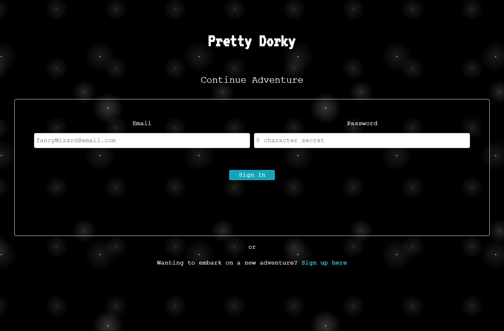
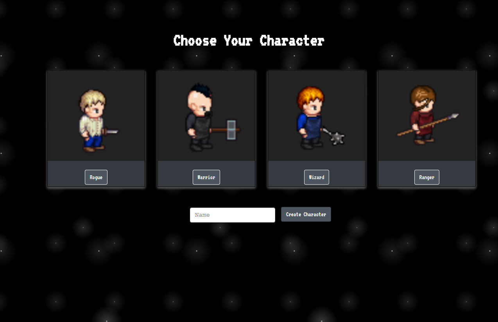

# Pretty Dorky

## Summary
Pretty dorky is a classic combination runner/RPG that pokes fun at developer themes.

## Authors
- [Amanda](https://github.com/aanderson120 "Amanda's Github")
- [Brooklynne](https://github.com/Izzle "Brooklynne's Github")
- [Lindsey](https://github.com/LindseyM20 "Lindsey's Github")
- [Violet](https://github.com/violettaval "Violet's Github")

## Endpoints
### Firebase/Firestore

We used this [walkthrough](https://blog.logrocket.com/user-authentication-firebase-react-apps/) from the [LogRocket Blog](https://logrocket.com/) as a guideline to build a firebase authentication.
We chose to use `react-router-dom` in place of `@reach/router`
The sign-in generates a unique UID that we pass to state with React, then write into our collection in Mongo as our "key" to retrieve the character for the signed in user.

### MongoDB 
* POST Creates a collection with character data.

* GET reads the character data.

* UPDATE will update when the state changes for a character during gameplay.

## Set up

Complete the following steps to start a new project (YOUR-APP-NAME):

1. Clone this repository to your local machine `git clone git@github.com:LindseyM20/team-rpg.git YOUR-APP-NAME`
2. `cd` into the cloned repository
3. Install the node dependencies `npm install`

## Scripts

Start the application `npm start`

## Deploying

When your new project is ready for deployment, add a new Heroku application with `heroku create`. This will make a new git remote called "heroku" and you can then `npm run deploy` which will push to this remote's master branch.

## Resources for Game Logic

Beautiful sprite sheets were built with ease thanks to:
[Sprite Sheet Generator](https://github.com/Gaurav0/Universal-LPC-Spritesheet-Character-Generator)

This tutorial for animating sprites with arrow keys was super helpful in getting us going to wire the sprites to our page using React hooks!
[Sprite Sheet Animation Tutorial](https://www.youtube.com/watch?v=DqpPgK13oEM)

This tutorial helped us create an SVG pixel-art healthbar that is responsive to our React state:
[React Pixel to SVG tutorial](https://www.youtube.com/watch?v=GhjAxQtABtE)

Our overworld was inspired by what we believed to be [The Easiest JavaScript Game Ever](https://www.youtube.com/watch?v=bG2BmmYr9NQ&list=WL&index=6&t=272s). We followed this HTML/CSS/JavaScript tutorial and refactored the logic to fit our React App and design.
